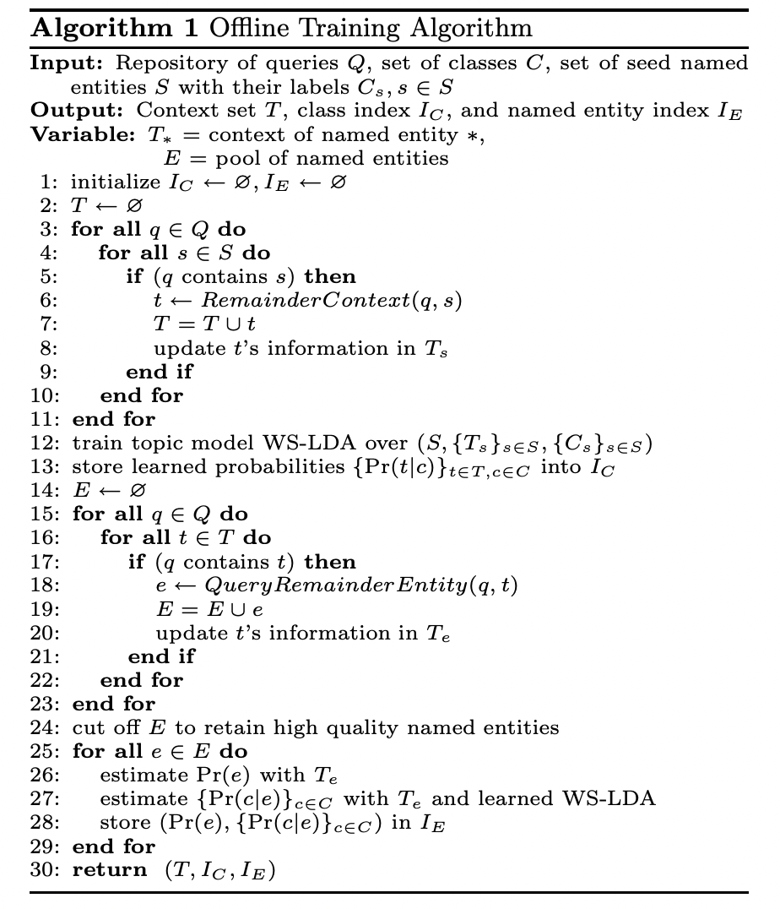
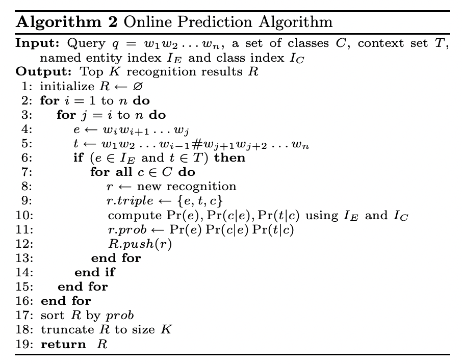
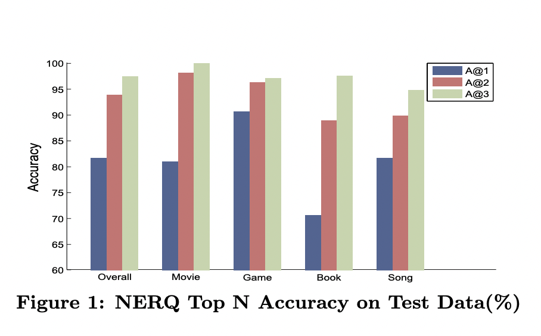
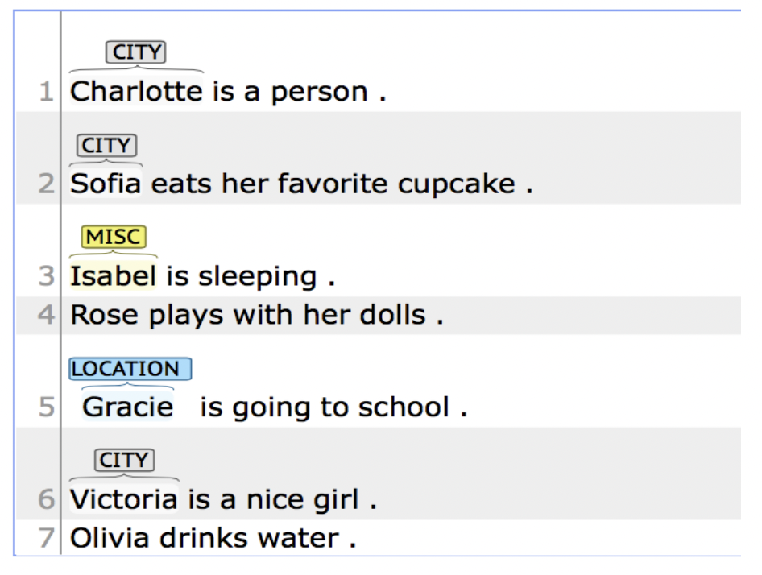

# Named Entity Recognition with Partially Supervised Latent Dirichlet Allocation

In my final project for CSDS 495 (Statistical Natural Language Processing) at Case Western Reserve, I implement an algorithm to predict named entities and their classes based mainly on an implementation in 2009 by Guo et. al [1] that uses weakly supervised latent dirichlet allocation. I extend this paper to use adversarial bias training in a tractable manner to treat regularity bias, a pertinent problem in named entity recognition (NER).

Named entity recognition is the task in natural language processing of identifying and classifying named entities in text, such as people, organizations, locations, and other entities. This is an important task in natural language processing, as it allows for the extraction of structured information from unstructured text.

Latent dirichlet allocation (LDA) is a generative probabilistic model that is commonly used in topic modeling and is usually unsupervised. The model is based off of the concept of having latent variables that are based on the current sequence of words which are the observable variables. It assumes that each document is a mixture of a fixed number of topics, and that each word in the document is associated with one of the topics. In weakly supervised LDA for named entity recognition, the topics are labeled with named entity categories, and the model is trained on a corpus of documents with partial named entity annotations.

## Survey 
##### Named Entity Recognition in Query (Guo et. al, 2009)
This paper presented a novel approach at the time to Named Entity Recognition in Query, which involves detecting named entities in a given query and classifying them into predefined classes. The approach uses query log data and Latent Dirichlet Allocation (LDA) to construct a probabilistic model for NERQ. The paper proposes a method called Weakly Supervised Latent Dirichlet Allocation (WS-LDA) for constructing the model, which uses weakly supervised learning rather than unsupervised learning. Experimental results show that WS-LDA can accurately perform NERQ and outperform baseline methods. This approach could be useful in applications such as web search, where identifying named entities in queries can help improve search results and query suggestions.

Weakly supervised latent dirichlet allocation takes into account the importance of context and the fact that a single entity can have multiple classes. An example they kept coming back to in the paper was " harry potter walkthrough" in which the named entity is "Harry Potter" and although it is usally seen in the context of a movie or a book, in that particular context it is related to a game.

The paper used a probabilistic approach and represented all queries as triples (e, t, c) where e is the entity, t is the context and c is the class or the entity label. The goal was to detect a named entity and what class it belonged to. "harry potter waltkthrough" would be equivalent to ("harry potter", "# walkthrough", *) where * indicates that any class is possible, and the # is used to indicate the position of an entity.

The probability of a triple could be found by:
Pr(e,t, c) = Pr(e)Pr(c|e)Pr(t|e,c) = Pr(e)Pr(c|e)Pr(t|c)

The required learned problem can then be represented as:
max $$\underset{i=1}{\overset{N}{\Pi}} Pr(e_i, t_i) = max \underset{i=1}{\overset{N}{\Pi}} Pr(e_i)\sum Pr(c|e_i)Pr(t_i|c)$$            (1)

where N is the number of labeled queries present. 

The paper used two algorithms, one to calculate these probabilities and one to detail the ways of predicting these probabilities for unseen data. The images of both of them are below (Fig 1 and Fig 2). A part brushed over in the offline learning algorithm, the first one, is the training using WS-LDA. 





To train using weakly supervised LDA, the paper's algorithm first used mapped the terms to words used in topic modelling, with the context being the words, the named entity being the document and the class being the topic. For the actual model, they drew a distribution of $\theta$ for all the topics using a Dirichlet distribution with the Dirichlet parameter $\alpha$, and threw a topic assignment for each word, $z_n$ using a multinomial distribution over $\theta$ and a multinomial distribution for each word conditioned on the drawn topic $z_n$

Using these values, the algorithm aimed to maximize an objective function and minimize the KL divergence between the variational posterior probability and the actual posterior probability. The variational posterior probability is calculated using (1). A variational expectation maximization algorithm is then used to estimate $\theta$. The predictions also use WSLDA for unseen tokens in the online learning algorithm.

The results were very good, as seen in the image below, where 1, 2 and 3, correspond to the number of top results looked at. For N=2, the result was marked correct if one of the 2 top results was correct. 




The convergence speed was also found to be higher than regular LDA. They also found that setting the value of $\lambda$, used to control the level of supervision, higher, improved the accuracy, but only up to a certain point where supervision was overemphasized. 

The authors were able to succesfully investigate the problem of named entity recognition in query and proposed a probabilistic approach that worked.


##### Context-aware Adversarial Training for Name Regularity Bias in Named Entity Recognition (Ghaddar et. al, 2021)
This paper looked at name regularity bias in named entity recogniton and about how it comes up because of too much focus on the entity name, and not enough focus on the local context itself. One of the examples looked at was 'Obama is located in Japan' that does not use enough context and identifies 'Obama' as a person. They showed that all state of the art models show this bias, and that feature based models perform poorly. Below, are some more examples of name regularity bias. 



To test the existing models, they used a benchmark called NRB (named regularity bias) that used named entities that is a real world entity, is compatible with any annotation scheme and whose tag is dependent solely on the local context. To grab examples, they used the Wikipedia disambiguation pages which is for words that could relate to different Wikipedia pages and thus different entity labels.

They suggested three methods of reducing bias and increasing contextual awareness. The first was masking, where any entity followed by three non-entities was replaced by a [MASK] token. This applied to more than 30% of total entities and forced the model to use the context to figure out the token The second was freezing, where some of the layers are frozen during fine-tuning, again enforcing the contextual ability, by freezing some parameters that are not tied to context. The third method was adversarial noise that added a noise vector $y_{ij}^{'}$ based on $y_{ij}$ where $y_{ij}^{'}$=
$y_{ij}(t^{'})$ when
$$p \sim U(0, 1) \leq \lambda$$
such that $$(t^{'} \sim \underset{y \in T \backslash {t}}{Cat}(\gamma|\epsilon = \frac{1}{K-1})$$
and
$y_{ij}(t)$ otherwise

where T is the set of class labels of size K, $y_{ij}^{t}$ represents a mention of type t in T, in the sequence of indices between i and j. $\lambda$ is a threshold parameter, U(0,1) is a uniform distribution in the range [0,1] and $Cat..$ is a distribution that has equal probabilities for both results. 

Essentially, this model replaces some of the gold-standard correct label in $y$ with a noisy label to be trained on. This was only applied for named entities that were preceded and followed by 3 context words.

Using these methods, the authors found that each method improved the performance signficantly, especially adversarial noise, with the F1-score on the CoNLL NRB  dataset for E-LSTM jumping from 75.6 to 86.1. It jumped to 82.9 and 83.1 on using masking and freezing respectively. Using all three combined brought the F1-score to 89.7. The F1-score remained almost constant for the regular testing dataset. They also found significant improvements in multilingual models.

Overall, the paper was able to highlight the importance of local contextual information for named entity recognition and the fact that the current state of the art models still have room to improve when it comes to NRB. Possible further research steps would be using similar adversarial training for other NLP tasks and testing the same framework for newer non-sequential labeling approaches.

#### Other papers
I also looked into a paper that talked about making NER a few-shot learning problem that focused on contextual representations again, as opposed to learning a prototype of the entity as a form of meta-learning, and applied it to BERT and BiLSTM. [3] I also looked at another paper that talked about incorporating Twitter data for multimodal learning in named entity recognition. [4] I only briefly scanned these papers and decided against incorporating them.

#### Comparisons
Ghaddar et. al and Guo et. al both looked at the importance of context for determining the class. However, Ghaddar et. al applied a tractable process to BERT as opposed to creating a completely new model. Guo et. al's model is also more probabilistic based as opposed to BERT that uses an encoder with several layers. It is interesting that 12 years after the earlier paper came out with so many advances in the field, the concept of local context is revisited with the newest models almost using too many features and needing to be adversarially trained to be simpler.

## Methods
I implemented both the offline training and online prediction almsot exactly based on Guo et. al's algorithm as described in the images above (Fig 1 and Fig 2). To implement the intricacies of WSLDA, I used the tomotopy package. I used this package since it was the only implementation of partially supervised LDA I could find online. The package uses conditional Gibbs sampling as opposed to the variational inference that the paper I was basing my project off of uses. The model let me input labels for each document. To make the model 'partially supervised', I set a parameter $\gamma$ to randomly choose whether to include the document's labels certain percentage. I trained the model on only the contexts based on the algorithm. 

By implementing the algorithms, I ended up with three probabilities that I used: p(context|class), p(class|entity) and p(entity) that I used in tandem to predict probabilities. I skipped the step where all of the entities were found in the algorithm, and instead used all entities as seed entities. I decided to do this to reduce computational time, and because I did not have much training data so the seed entities would be tiny compared to the seed entities that the researchers were using. The p(context|class) was calculated using the trained LDA model, the p(class|entitty) was calculated using the distrubution of classes for each entity, and the p(entity) was calculated using the distribution of total entities. I also tried both using and not using the trained model during inference in tandem with the calculated probabilities. I experimented with not using it as a possible research extension but also because of the problems the package gave including 1) slow computation 2) unavailability on M1 Macbooks (had to use Rosetta Terminal and Python) 3) inability to be pickled. .

A key feature that was not required in the paper was window size. The feature was not required by the paper since their inputted queries were already of smaller sizes. I set the window size to 1 or 2, and collected all the contexts of size 1 to 2*window_size, not including the entity. This included contexts using only the left window and only the right window. In total, that included 3*window_size strings for each word. I mapped all entities to '#' no matter their length. 

## Research 

For a research extension, I looked at how adversarial trainng could be implemented to eliminate bias since bias is a pertinent problem in named entity recognition as detailed by Ghaddar et. al. Additionally, Guo et. al's paper itself asserts that their way of estimating the probabilities inherently is biased when calculating the probabilities of entities. I focused on two of the three algorithms suggested for them in training to reduce bias. I could not implement the third, since it focused on freezing part of the BERT netwrork they were using. The first algorithm focused on masking. I masked all entity names that had three non-entities following them. The third algorithm was adversarial noise. I used a threshold value of 0.8 for this algorithm, similar to the paper I looked at and followed a similar structure, where there was an 80% chance that entities that had 3 or more context words before and after would be replaced by a noisy entity.

For a second research extension, I looked at other ways WSLDA could be improved, since the algorithm proved to be based too much on appearances of previous contexts. I tried using and not using the trained PLDA model again to infer the probabilities of unseen entities, and using the trained PLDA model again always worked better. Further, another problem with the algorithm is that it does not look for 'O' or words outside of the named entity. So, I tried adding a second map that calculates contexts for words outside of the named entity too, but was not able to implement it completely. I also experimented with including the entity itself, instead of replacing it with '#' but that did not improve results. I also considered using Twitter as a secondary dataset to improve performance.

## Result Analysis

I trained my model with the CoNLL-02 dataset training set. I tested my model using the same dataset's testing set. The algorithm was not built to take into account the specificities of 'inside' and 'beginning' of entities, so I made predicitions with and without those additional tags. For predictions, I divided the testing data into sequences and inputted them into the online predicting method, making sure that the sequences all belonged to the same sentence. 

All of the results are in the README.md in the results folder. Overall the f1-score was 0.62 which is average. The score was also helped largely by the "O" f1-score with the other label F1-scores being much lower. I also tried removing the usage of the model and found the f1-score to be around 0.35. However, I continued to not use the model at times to see the effects of changes to the model parameters since with the model predictions took around half an hour, and without around five minutes on my machine (M1 Macbook Air 2020 8GB RAM). 

A big reason for the average at best performance is the fact that the algorithm is a combination of memorized information and the trained model, with the memorized probabilty values more accurate. The paper's model was originally trained on a much larger dataset containing over 6 billion queries. This large dataset allowed the authors to use more contextual memorization. The performance tends to increase based on the amount of data being used. Additionally, the queries chosen by the paper's authors were chosen in a way that they were around 3 or 4 words long including the entity and included important context within those words. A similar dataset was used for testing. ConLL does not necessarily have to include that context in the nearest two words, and it does not have to include a specific context as well. Since this model is based mainly on context, this is a weakness that could lead to its performance. We also used Conditional Gibbs sampling as opposed to variational inference for training that could have also had an effect.

I experimented with different values of gamma and window_size, and did find that a higher gamma improved performance, upto 80% of the training set being labeled. I also found better performance for a window_size of 1 as opposed to 2, that had an f1-score of 0.25. I also had to make a decision for the size of the sequences being predicted (sequence_size). I experimented with 3, 4 and 5, and found that 3 and 4 gave the best results. 

Masking had a minimal effect too and this could be because of two reasons. It is possible robably the model already masks the entities during training, and the only effect is during the calculation of Pr(entity) and Pr(class|entity). Also, Ghaddar et. al's paper itself did not show any improvements on masking on the regular CoNLL testing dataset, and used the NRB benchmark. Implementing that benchmark by using Wikipedia disambiguation pages might allow for improvements. Adding adversarial noise similarly did not have any effect. This could be because of the fact that the model is already based almost completely on context and there are no additional features as is the case with LSTMs and BERT. Again, using an NRB benchmark could show improvements.

Best result, using gamma=0.8, window_size=1, sequence_size=3 and using the trained model to infer the probability of unseen contexts given a class

                precision    recall  f1-score   support

         LOC       0.10      0.12      0.11      1925
        MISC       0.08      0.08      0.08       918
           O       0.91      0.69      0.78     38323
         ORG       0.12      0.45      0.19      2496
         PER       0.18      0.27      0.22      2773
    accuracy                           0.62     46435
    weighted avg   0.77      0.62      0.68     46435

## Conclusion
Weakly supervised LDA is not typically used for named entity recogntion but this project shows that there is enough reason to look into it further, given ethical problems with bias, and the importance that the algorithm gives to context. However, the algorithm does suffer from the implicit contextual memorization and the technicality possible in 2009. The research extension using masking and adversarial noise did not have a positive impact on the data, and both the implemented algorithm and the research extension may have both performed differently with datasets more in tune to each of their measurements.

## Bibliography

1. Guo, Jiafeng, et al. "Named entity recognition in query." Proceedings of the 32nd international ACM SIGIR conference on Research and development in information retrieval. 2009.
2. Ghaddar, Abbas, et al. "Context-aware adversarial training for name regularity bias in named entity recognition." Transactions of the Association for Computational Linguistics 9 (2021): 586-604.

3. Yang, Yi, and Arzoo Katiyar. "Simple and effective few-shot named entity recognition with structured nearest neighbor learning." arXiv preprint arXiv:2010.02405 (2020).

4. Suman, Chanchal, et al. "Why pay more? A simple and efficient named entity recognition system for tweets." Expert Systems with Applications 167 (2021): 114101.

## Setup
To run the code locally, please install all of the files in code/src/requirements.txt. This can be done with the following command.

```
pip install -r requirements.txt
```

If you are using an M1 Mac, you should use a Rosetta terminal to install all of the packages. To do this you can open up a Rosetta terminal, install the x86 version of Homebrew, install the x86 version of Python with that and use that to run your code. I recommend using a virtual environment like venv whether you are using an M1 Mac or not but that is not necessary. If you wish you use one you should do the following before the pip install command.
```
python -m venv venv
source venv/bin/activate
```
To run an experiment on the code, you should run
```
python -m src.LDA.runner.py
```
from the code directory. The structure of the code can be understood from this file and the files it calls. Additional tests can be run on different Python files but have to be run from the code directory as `python -m src....`
